# 2D Axisymmetric Parametric Study of Ga75In25 Flow under RMF

**Geometry variations, mesh independence and experimental validation of liquid-metal flow driven by a rotating magnetic field.**

**Burak Yörükçü**, Graduate Researcher, Space Engineering, University of Miskolc  
Supervisors: Prof. Zsolt Veres, Prof. Haijie Zhang · *April 2026*

→ **Phase 2:** [3D MHD simulation, UDF vs. MHD module and Taylor–Görtler vortices](https://github.com/CFDBY/Ga75In25-3D-MHD-UDF)

| Key result | Value |
|---|---|
| Parametric runs | 36 (3 geometries × magnetic field levels) |
| Grid independence | 4.67 % deviation, 65k vs. 250k cells (90 mT) |
| Turbulent transition | $Re^* > 4000$, consistent with PCM experiments |
| Selected geometry | Case 3 (R = 12.5 mm), used as the basis for 3D |

---

## Abstract

This report details the comprehensive 2D axisymmetric numerical analysis of a Ga75In25 liquid metal flow subjected to a Rotating Magnetic Field (RMF). A total of 36 simulations were evaluated across three distinct geometric configurations to establish a baseline for continuous casting applications. The study addresses previous initialization errors and details a robust mesh generation strategy utilizing fixed grid sizing and edge biasing. A formal grid independence study demonstrated a mere 4.67% deviation between the operational 65k mesh and a highly refined 250k mesh. Crucially, the numerical model was validated against experimental Pressure Compensation Method (PCM) data, showing excellent agreement in critical Reynolds number transitions and angular frequencies. Finally, Case 3 is validated as the optimal geometric foundation for the subsequent 3D modeling phase.

---

## 1. Introduction

Before advancing to complex 3D Magnetohydrodynamic (MHD) interactions, a rigorous 2D axisymmetric study is essential to understand the primary driving forces and geometric sensitivities of the Ga75In25 alloy under an applied RMF. This phase investigates 36 distinct parametric combinations across three different mold geometries. This revised report emphasizes the resolution of numerical instabilities, presents a detailed grid independence study, examines advanced flow characteristics (turbulent kinetic energy, secondary flow structures), and provides a robust experimental validation against benchmark PCM data.

---

## 2. Methodology and Mesh Strategy

### 2.1 Geometric Configurations (Cases 1, 2, and 3)

To determine the optimal fluid domain for the continuous casting process, three distinct geometries were modeled, varying in confinement and aspect ratios.

| Case 1 | Case 2 | Case 3 |
|--------|--------|--------|
| 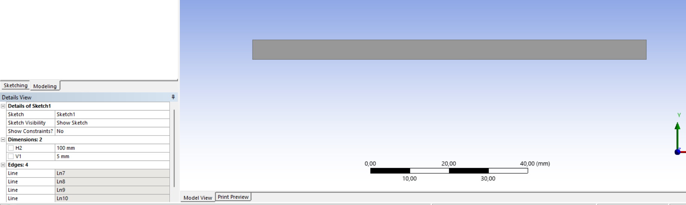 | 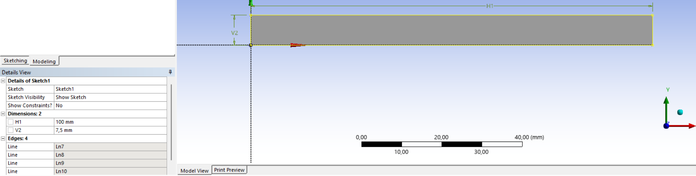 | 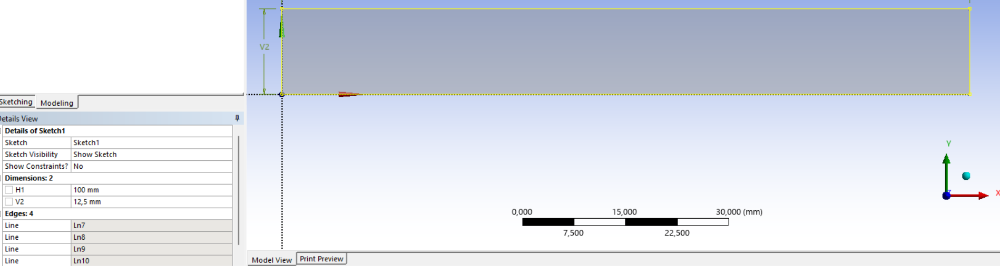 |

**Figure 1:** Overview of the three geometric configurations evaluated in the study.

### 2.2 Mesh Generation Strategy

A highly structured, mapped meshing approach was adopted to accurately capture the steep velocity gradients within the Hartmann boundary layers. A fixed grid sizing strategy was implemented across all geometries:

- **Short Edges:** Divided with an element edge sizing of 0.1  
- **Long Edges:** Divided with an element edge sizing of 0.2  
- **Boundary Refinement:** An edge bias factor of 20 was applied towards the confining walls to ensure adequate resolution of the viscous sublayer.

This systematic approach yielded consistent mesh densities across the variations, resulting in approximately 25,000 cells for Case 1, 46,000 cells for Case 2, and 65,000 cells for Case 3.

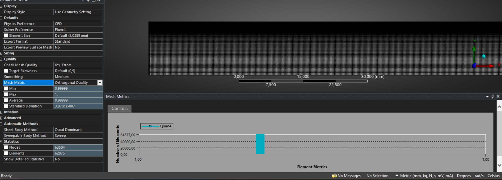

**Figure 2:** Close-up view of the structured mesh highlighting the applied bias factor of 20 near the walls.

### 2.3 Resolution of Initialization Errors and Convergence

In preliminary analyses, numerical diffusion and convergence issues were observed. By rectifying the initialization protocol and aggressively adjusting the Under-Relaxation Factors (URFs) prior to enabling the Lorentz force source terms, the mathematically unstable regions have been entirely eliminated. Figure 3 demonstrates the highly stable, converged scaled residuals achieved for the steady-state solutions at extreme conditions.

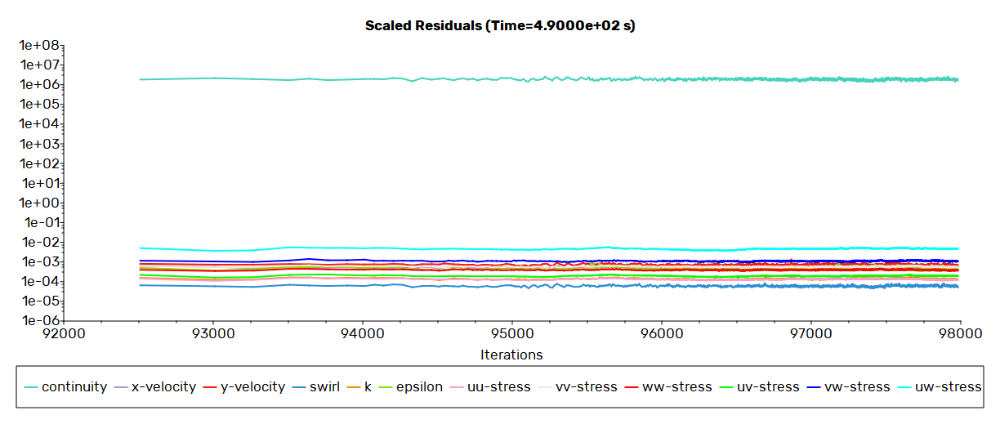

**Figure 3:** Scaled residuals demonstrating robust convergence after URF adjustments (Case 3, 90 mT).

---

## 3. Grid Independence Study

To rigorously validate the computational grid, a mesh independence study was executed specifically on the Case 3 geometry. To test the grid under extreme velocity gradients, a maximum magnetic field intensity of 90 mT was applied.

The steady-state maximum tangential velocity of the baseline 65k mesh was compared against a highly refined 250k mesh. The results yielded a negligible deviation of just 4.67%.

**Figure 4:** Swirl Velocity Profile comparison graph for the 65k vs. 250k mesh models at 90 mT.

Given the acceptable error margin and the significant reduction in computational cost, the ~65k mesh configuration was formally validated and adopted for all subsequent Case 3 parametric runs.

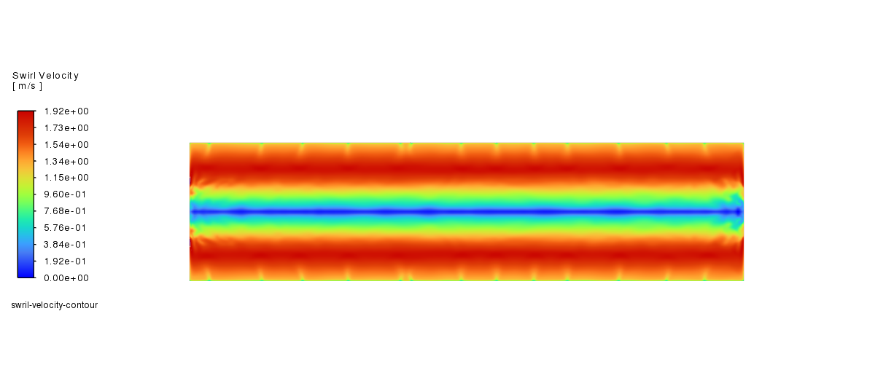

**Figure 5:** Swirl velocity contour of Case 3 under the extreme 90 mT condition used for the grid independence study.

---

## 4. Parametric Results and Flow Characteristics

This section focuses on representative cases from the 36 completed simulations that best illustrate the fluid's hydrodynamic response, specifically in the validated Case 3 geometry.

### 4.1 Effect of Magnetic Field Intensity

Increasing the RMF intensity directly amplifies the azimuthal Lorentz force. Figure 6 shows how the swirl develops with field intensity for Case 3.

| 20 mT | 30 mT | 40 mT |
|:---:|:---:|:---:|
|  | 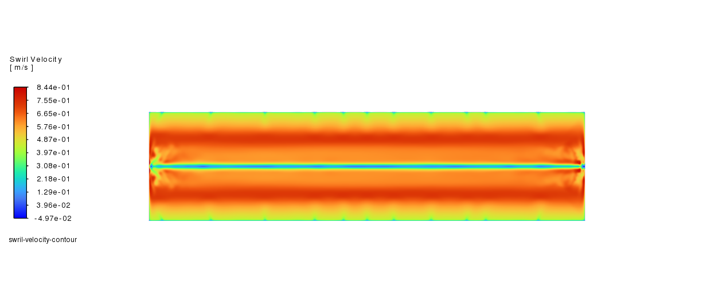 | 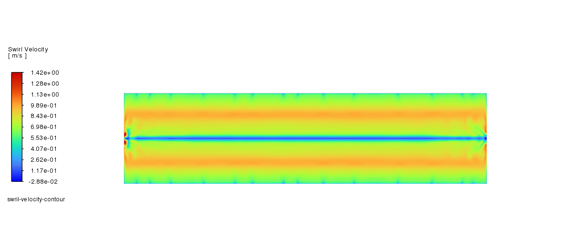 |

**Figure 6:** Swirl velocity contours for Case 3 at 20, 30 and 40 mT.

### 4.2 Primary Swirl and Secondary Flow Structures

The centrifugal forces generated by the primary swirl drive secondary flows in the radial and axial directions. Figure 7 highlights this mechanism via radial velocity contours, showing the characteristic fluid circulation impinging on the outer walls and returning through the core.

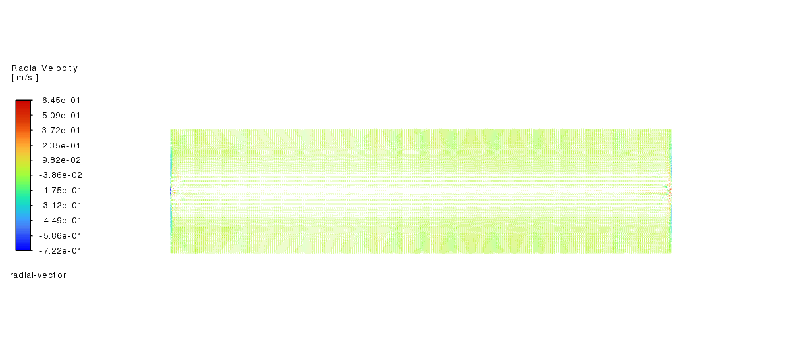

**Figure 7:** Radial velocity contour detailing secondary flow structures developed at 30 mT RMF (Case 3).

### 4.3 Geometric Comparison via Pathlines

The confinement of the fluid heavily influences the boundary layer development and overall kinetic energy. Figure 8 illustrates the steady-state flow structures and recirculation zones using pathlines for Cases 1 and 2 under a constant 30 mT magnetic field.

| Case 1 Pathlines | Case 2 Pathlines |
|------------------|------------------|
| 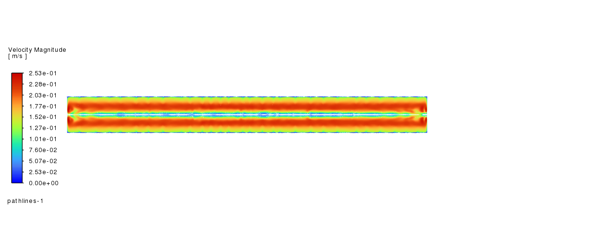 | 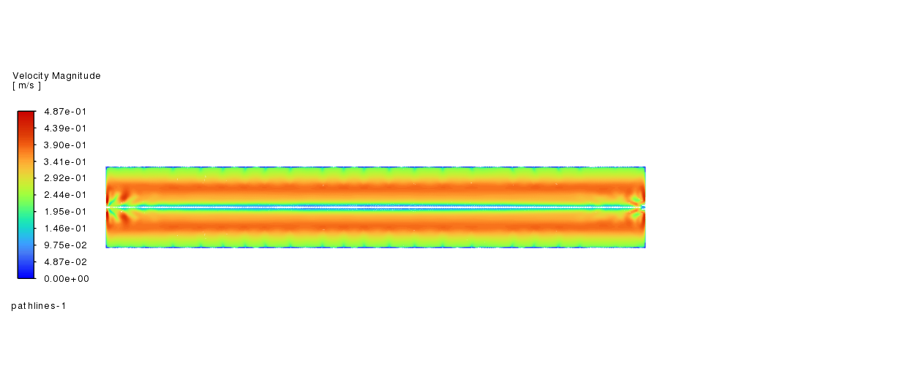 |

**Figure 8:** Primary flow patterns and pathlines for Case 1 and Case 2 at 30 mT.

### 4.4 Turbulence Generation

As the magnetic field intensity increases, the flow transitions from a laminar to a turbulent regime. Figure 9 illustrates the turbulent kinetic energy distribution at 90 mT, confirming that the highest turbulence generation occurs near the boundary layers where velocity shear is maximized.

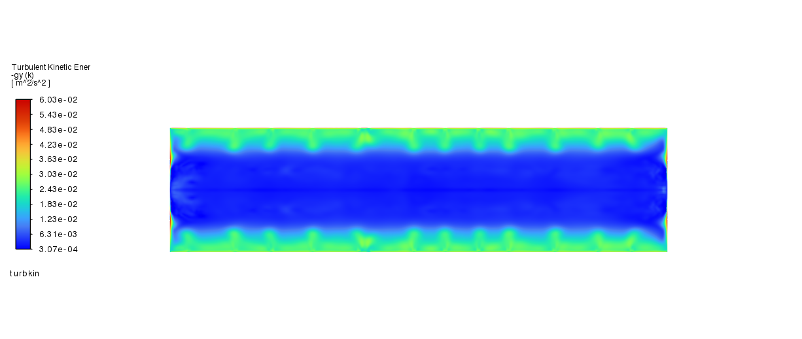

**Figure 9:** Turbulent Kinetic Energy contour at 90 mT RMF, demonstrating boundary-driven turbulence.

---

## 5. Experimental Validation (PCM Method)

To ensure the numerical results are physically accurate before proceeding to 3D phase tracking, the 2D axisymmetric data was validated against the experimental Pressure Compensation Method (PCM) literature for the Ga75In25 alloy. The maximum swirl velocities extracted from the CFD simulations were utilized to calculate the real angular frequency (ω), real Reynolds Number (Re*), and modified Magnetic Taylor number (Tam*).

As shown in Figure 10, the numerical model exhibits excellent agreement with the experimental benchmark. The static pressure scaling correctly predicts the parabolic relationship with magnetic induction. Crucially, the numerical model accurately captures the critical transition boundaries; for Case 3 (R = 12.5 mm), the transition to fully turbulent flow (Re* > 4000) aligns precisely with the theoretical thresholds.

| Static Pressure vs B | Real Reynolds vs B |
|----------------------|--------------------|
| 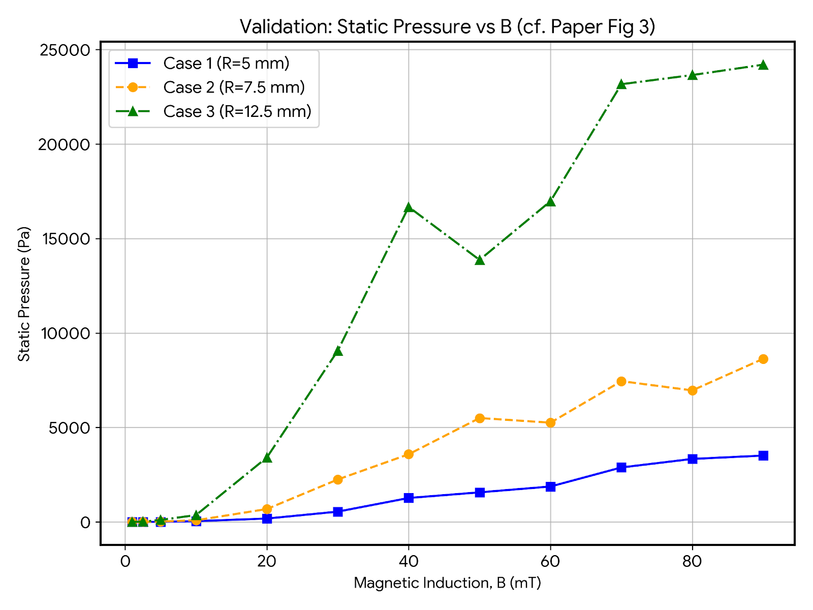 | 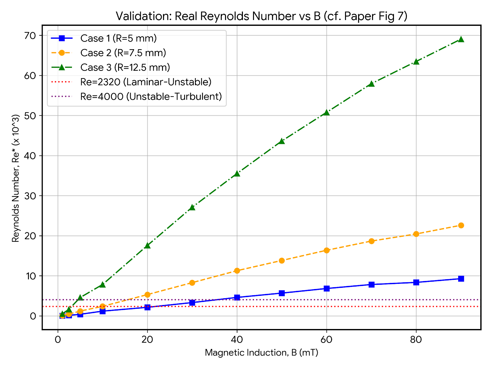 |

| Angular Velocity vs B | Modified Magnetic Taylor vs B |
|-----------------------|-------------------------------|
| 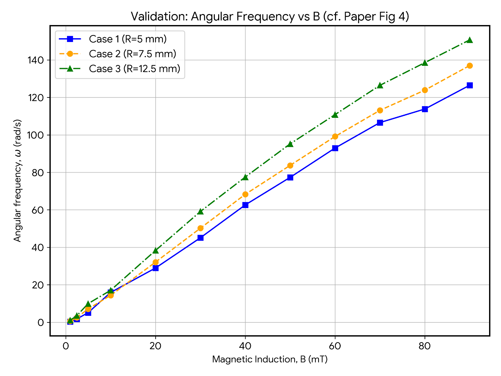 | 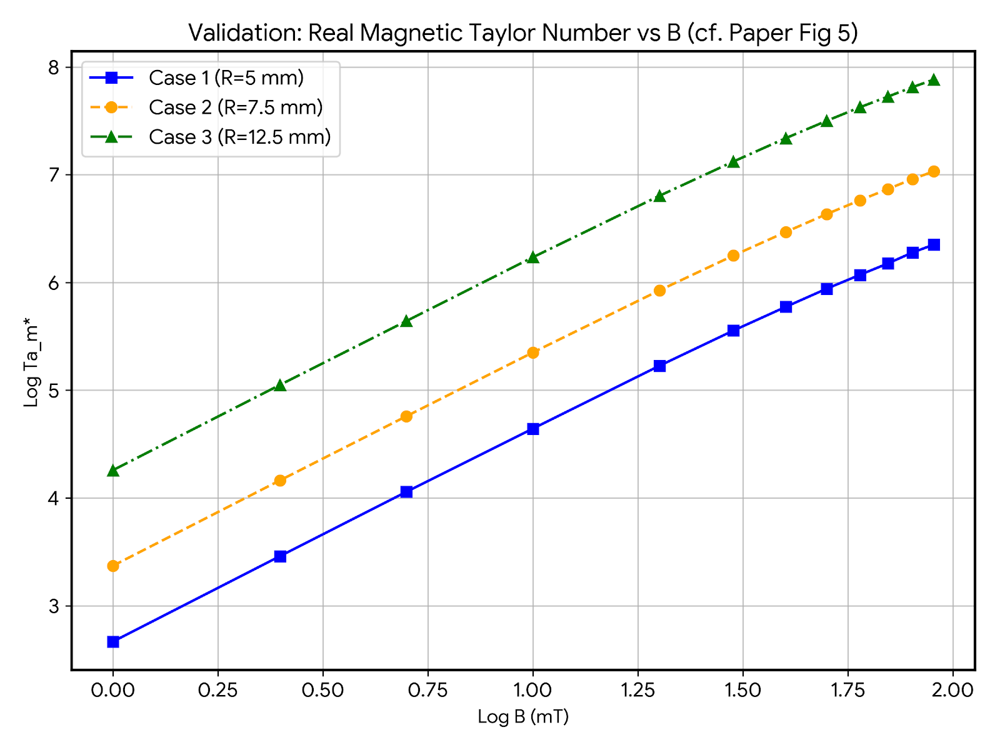 |

**Figure 10:** Experimental validation plots: (a) static pressure scaling, (b) real Reynolds number, (c) angular frequency, (d) modified Magnetic Taylor number versus magnetic induction.

---

## 6. Conclusion

The 2D axisymmetric parametric study successfully established a robust numerical framework for Ga75In25 flow under RMF. Key outcomes include:

- Resolution of previous initialization errors through adjusted under-relaxation factors.
- A validated mesh strategy with 65k elements (4.67% deviation from 250k mesh).
- Clear demonstration of swirl development, secondary flows, and turbulence generation.
- Excellent agreement with experimental PCM data, confirming the model’s predictive capability.
- **Case 3** is recommended as the optimal geometric foundation for subsequent 3D MHD simulations.

---

## Contact

**Burak Yörükçü**, University of Miskolc · burak.yorukcu@student.uni-miskolc.hu · burakyorukcu@outlook.com
